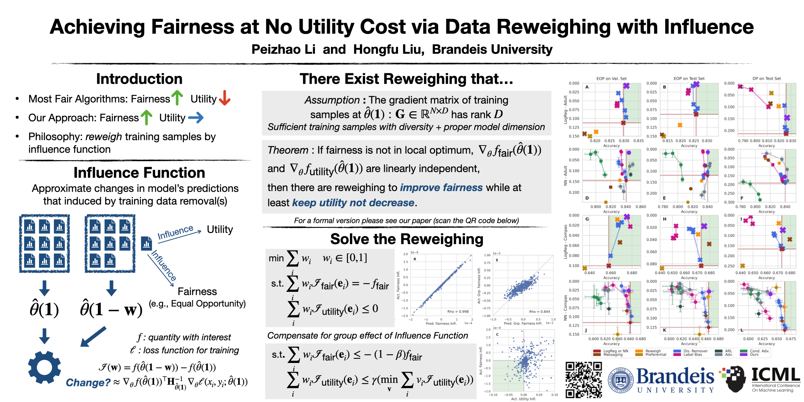

# Achieving Fairness at No Utility Cost via Data Reweighing with Influence
Code for ICML 2022 paper: Achieving Fairness at No Utility Cost via Data Reweighing with Influence



Please cosider cite our paper is you find our research helpful.

### Reference
```
@InProceedings{pmlr-v162-li22p,
  title = 	 {Achieving Fairness at No Utility Cost via Data Reweighing with Influence},
  author =       {Li, Peizhao and Liu, Hongfu},
  booktitle = 	 {Proceedings of the 39th International Conference on Machine Learning},
  pages = 	 {12917--12930},
  year = 	 {2022},
  editor = 	 {Chaudhuri, Kamalika and Jegelka, Stefanie and Song, Le and Szepesvari, Csaba and Niu, Gang and Sabato, Sivan},
  volume = 	 {162},
  series = 	 {Proceedings of Machine Learning Research},
  month = 	 {17--23 Jul},
  publisher =    {PMLR},
  pdf = 	 {https://proceedings.mlr.press/v162/li22p/li22p.pdf},
  url = 	 {https://proceedings.mlr.press/v162/li22p.html},
  abstract = 	 {With the fast development of algorithmic governance, fairness has become a compulsory property for machine learning models to suppress unintentional discrimination. In this paper, we focus on the pre-processing aspect for achieving fairness, and propose a data reweighing approach that only adjusts the weight for samples in the training phase. Different from most previous reweighing methods which usually assign a uniform weight for each (sub)group, we granularly model the influence of each training sample with regard to fairness-related quantity and predictive utility, and compute individual weights based on influence under the constraints from both fairness and utility. Experimental results reveal that previous methods achieve fairness at a non-negligible cost of utility, while as a significant advantage, our approach can empirically release the tradeoff and obtain cost-free fairness for equal opportunity. We demonstrate the cost-free fairness through vanilla classifiers and standard training processes, compared to baseline methods on multiple real-world tabular datasets. Code available at https://github.com/brandeis-machine-learning/influence-fairness.}
}
```

## Setup

## Experiment
